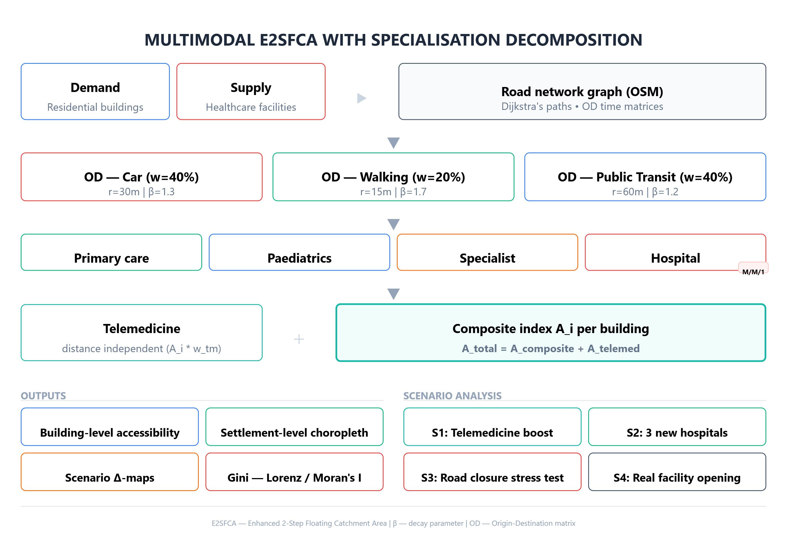
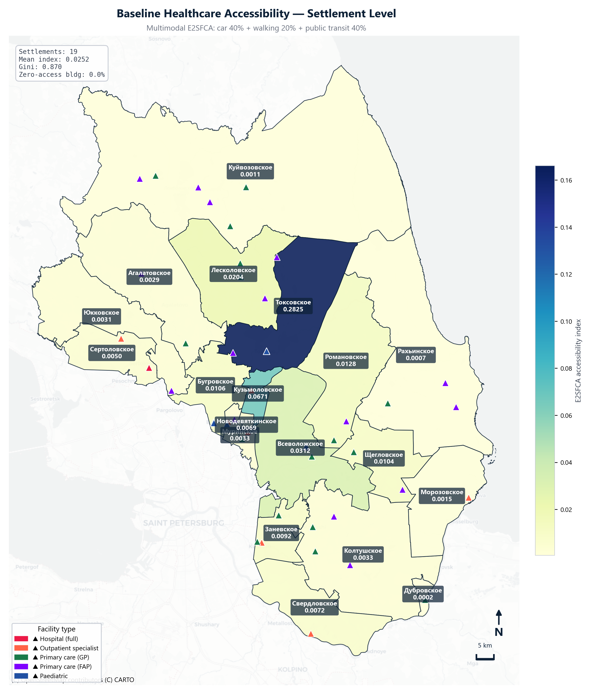
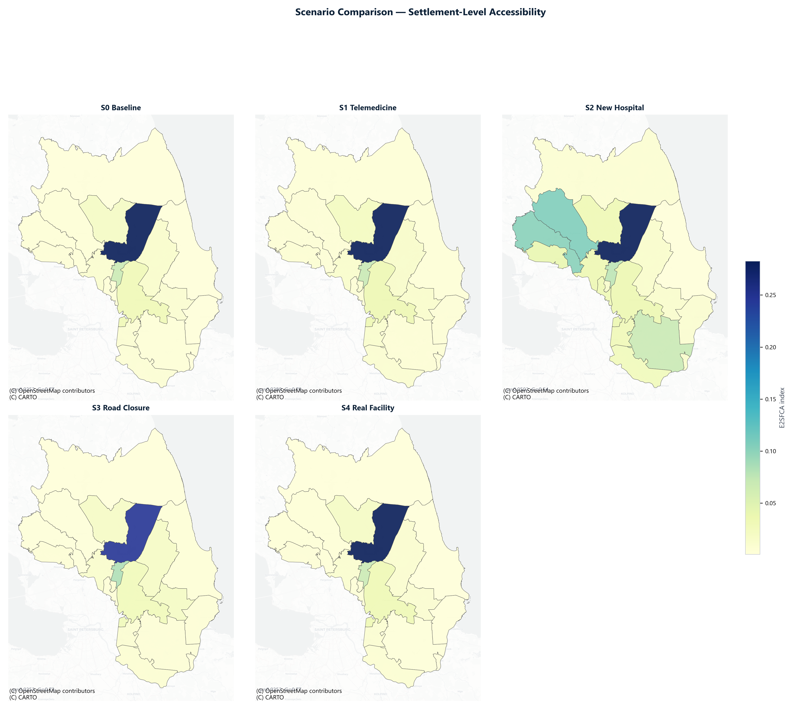

# access_lib

**Multimodal E2SFCA Healthcare Accessibility Analysis**

A Python library for evaluating spatial accessibility of healthcare facilities using the Enhanced Two-Step Floating Catchment Area (E2SFCA) method with multimodal transport decomposition, medical specialisation layers, and M/M/1 queue correction.



---

## Key Features

- **Multimodal transport** — car, walking, and public transit with independent catchment radii and Gaussian decay
- **Specialisation decomposition** — four healthcare layers: primary care, paediatrics, specialist outpatient, inpatient (hospital)
- **M/M/1 queue correction** — capacity adjustment based on single-server queuing theory
- **Four policy scenarios** — telemedicine boost, new hospital placement, road closure stress test, real facility opening
- **Inequality metrics** — Gini coefficient, Lorenz curves, Moran's I spatial autocorrelation
- **Monte Carlo simulation** — parameter uncertainty quantification
- **Sensitivity analysis** — systematic exploration of decay parameter (β) and catchment radius (r)
- **Publication-ready maps** — settlement choropleths, building-level quintile maps, before/after scenario maps, delta maps

## Study Area

Vsevolozhsky District, Leningrad Oblast, Russia — 19 settlements, 589,000 residents, 49 healthcare facilities.



## Installation

### From PyPI

```bash
pip install access-lib
```

### From source (development)

```bash
git clone https://github.com/Lizatol/access_lib.git
cd access_lib
pip install -e ".[full,dev]"
```

### Optional dependencies

```bash
# Spatial statistics (Moran's I, LISA)
pip install access-lib[spatial]

# Interactive Folium maps
pip install access-lib[interactive]

# Everything
pip install access-lib[full]
```

## Quick Start

```python
from access_lib.config import Config
from access_lib.core import composite_accessibility, gini

# Load configuration and data
cfg = Config()
# ... load GeoPackage files ...

# Compute multimodal E2SFCA
A = composite_accessibility(
    od_matrices=OD_matrices,
    demand=demand,
    supply=supply,
    params=cfg.e2sfca,
    mode_weights=cfg.mode_weights.as_dict(),
)

print(f"Mean accessibility: {A.mean():.5f}")
print(f"Gini coefficient:   {gini(A):.3f}")
```

See [`examples/walkthrough.ipynb`](examples/walkthrough.ipynb) for a complete end-to-end analysis.

## Method

### E2SFCA with Gaussian Decay

The Enhanced Two-Step Floating Catchment Area method computes an accessibility index for each demand point (residential building):

**Step 1 — Supply-to-demand ratio:**

$$R_j = \frac{S_j}{\sum_{k \in \{d_{kj} \le r\}} D_k \cdot W(d_{kj}, \beta, r)}$$

**Step 2 — Accessibility index:**

$$A_i = \sum_{j \in \{d_{ij} \le r\}} R_j \cdot W(d_{ij}, \beta, r)$$

Where $W(t, \beta, r) = \exp\left(-\left(\frac{t}{\sigma}\right)^2\right)$ is the Gaussian decay function with $\sigma = r \cdot 0.5 / \sqrt{\beta}$.

### Multimodal Composite

$$A_{\text{composite}} = w_{\text{car}} \cdot A_{\text{car}} + w_{\text{walk}} \cdot A_{\text{walk}} + w_{\text{pt}} \cdot A_{\text{pt}}$$

Default weights: car 40%, walking 20%, public transit 40%.

| Mode | Catchment radius | Decay β |
|------|-----------------|---------|
| Car | 60 min | 1.5 |
| Walking | 30 min | 1.0 |
| Public transit | 90 min | 1.2 |

### Specialisation Decomposition

Healthcare facilities are grouped into four specialisation layers, each computed independently:

| Layer | Facility types |
|-------|---------------|
| Primary care | Therapist clinics, FAPs |
| Paediatrics | Children's polyclinics |
| Specialist outpatient | Outpatient clinics, maternal health |
| Inpatient (hospital) | Full-service hospitals |

The hospital layer includes M/M/1 queue correction: effective capacity is reduced by $\exp(-\alpha \cdot W_q)$ where $W_q = \rho / (\mu(1-\rho))$.

## Scenarios

| Scenario | Description | Effect |
|----------|------------|--------|
| **S1: Telemedicine** | Distance-independent virtual care capacity | +19% mean, Gini −0.09 |
| **S2: New hospitals** | 3 hospitals in worst-served settlements (greedy placement) | +170% mean, Gini −0.21 |
| **S3: Road closure** | ~10 km closure in Toksovo + Bugrovo (stress test) | Localised degradation |
| **S4: Real facility** | Actual planned hospital opening | +1.2% mean |



## Architecture

```
access_lib/
├── config.py              # Configuration dataclasses
├── core/
│   ├── engine.py          # E2SFCA computation engine
│   ├── demand.py          # Population distribution to buildings
│   ├── facilities.py      # Facility processing and capacity
│   ├── graph.py           # Road network graph construction
│   ├── od_matrix.py       # Origin-Destination matrix computation
│   ├── aggregation.py     # Building → settlement aggregation
│   ├── specialization.py  # Healthcare layer decomposition
│   └── isochrones.py      # Isochrone analysis
├── scenarios/
│   ├── base.py            # ScenarioResult dataclass
│   ├── telemedicine.py    # S1: telemedicine boost
│   ├── new_hospital.py    # S2: optimal hospital placement (greedy)
│   ├── road_closure.py    # S3: road closure stress test
│   └── real_hospital.py   # S4: real facility opening
├── simulation/
│   ├── monte_carlo.py     # Monte Carlo uncertainty analysis
│   └── sensitivity.py     # Parameter sensitivity (β, r)
├── stats/
│   └── spatial.py         # Moran's I, LISA, spatial statistics
└── viz/
    ├── style.py           # Colour palette, constants
    ├── maps.py            # Cartographic visualisations
    ├── charts.py          # Statistical charts (Lorenz, bars, heatmaps)
    ├── method_diagram.py  # E2SFCA architecture diagram
    └── interactive.py     # Folium interactive maps
```

## Data Requirements

Input data should be provided as GeoPackage (`.gpkg`) files:

| File | Contents | Key columns |
|------|----------|-------------|
| `residential.gpkg` | Building footprints | `geometry`, `building_floors` |
| `facilities.gpkg` | Healthcare facilities | `geometry`, `specialization`, `capacity` |
| `boundaries.gpkg` | Settlement boundaries | `geometry`, `name`, `population_2025` |
| `roads.gpkg` | Road network | `geometry`, `highway`, `maxspeed` |
| `bus_stops.gpkg` | Public transit stops | `geometry` |

Sample data for Vsevolozhsky District is included in [`data/sample/`](data/sample/).

## Citation

If you use this library in your research, please cite:

```bibtex
@software{tolmacheva2026accesslib,
  author    = {Tolmacheva, Elizaveta M.},
  title     = {access\_lib: Multimodal E2SFCA Healthcare Accessibility Analysis},
  year      = {2026},
  url       = {https://github.com/Lizatol/access_lib},
  version   = {0.1.0},
}
```

## References

- Luo, W., & Qi, Y. (2009). An enhanced two-step floating catchment area (E2SFCA) method for measuring spatial accessibility to primary care physicians. *Health & Place*, 15(4), 1100–1107.
- Dai, D. (2010). Black residential segregation, disparities in spatial access to health care facilities, and late-stage breast cancer diagnosis in metropolitan Detroit. *Health & Place*, 16(5), 1038–1052.
- McGrail, M. R., & Humphreys, J. S. (2014). Measuring spatial accessibility to primary health care services: Utilising dynamic catchment sizes. *Applied Geography*, 54, 182–188.

## License

[MIT License](LICENSE) — free for academic and commercial use.

## Author

**Elizaveta Tolmacheva**
ITMO University, Institute of Design and Urban Studies
Saint Petersburg, Russia
